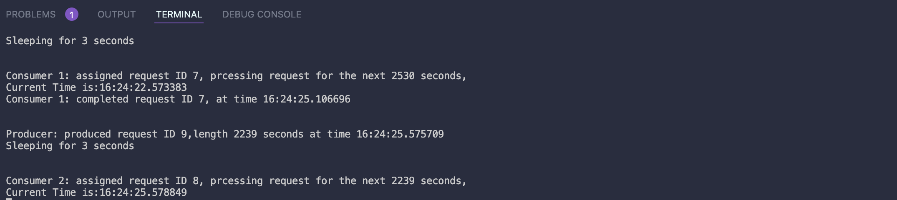

# COSC315 Mini Project2

Developed By:
Florencia Chomski,
Kshitij Suri &
Ahmad Raza Jamal 

### <strong> Build Instructions (How to Compile the Code!) </strong>
<strong>Java Implementation</strong>\
In order to build the Java implementation of this mini project 2, simply run the java compiler from within Visual Studio Code for the RequestScheduler.java file.   

<strong>C/C++ Implementation</strong>\
To build the file, type the command <i>gcc producerConsumerProblem.c </i> into Terminal. 
  

### <strong>Run Instructions</strong>
<strong>Java Implementation</strong>\
In order to run the Java implementation of this project, first build the program as per the instructions outlined earlier. Then, enter the number of slave threads to employ as prompted in the terminal, the maximum duration of sleep before the next request, as well as the maximum duration of a request. After entering all the aforementioned fields, the program will begin to run.   

<strong>C/C++ Implementation</strong>\
To run the producerConsumerProblem.c file, type the command <i>./a.out</i> into Terminal.
  

### <strong> Our Experience Implementing This Problem in Java and C/C++ </strong>
Solving this problem in Java was quite a bit easier than the C/C++ implementation for a few reasons. First of all, all of our team members are familiar with Java. In addition, debugging the code within Visual Studio Code is quite straightforward in Java. On the other hand, only one of our team members has previous knowledge in C/C++. This made it much more difficult to complete this section. Further, C/C++ do not support monitors which added another layer of difficulty as we had to implement semaphores to make the problem work.

### <strong> Sample Output </strong>
<strong>Java Implementation</strong>

<i>Entering arguments into RequestScheduler.java</i>   

<i>RequestScheduler.java running</i>   

<strong>C/C++ Implementation</strong>

<i>producerConsumerProblem.c running</i>   
